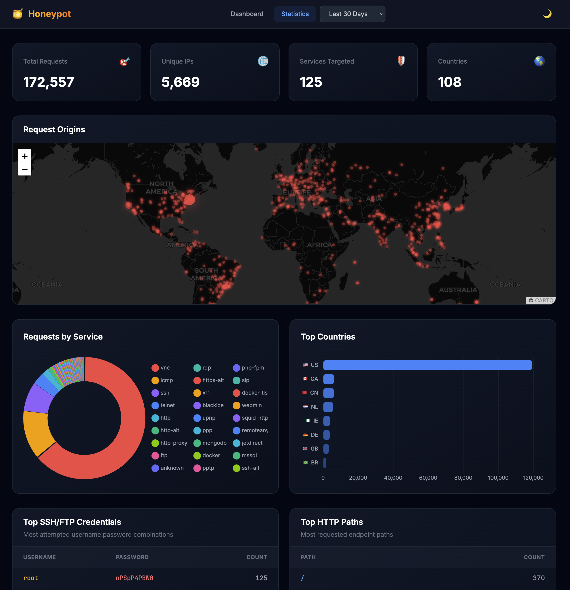

# Honeypot 🍯

A low-interaction network honeypot with real-time attack visualization.


## Demo

Check out the **[Live Demo](https://echo.shmakov.net/)**.

<a href="https://echo.shmakov.net/">
  <picture>
    <source media="(prefers-color-scheme: dark)" srcset="static/demo_dark.png">
    <source media="(prefers-color-scheme: light)" srcset="static/demo_light.png">
    
  </picture>
</a>

## Features

- **Real-time Dashboard** - Live attack feed with SSE streaming
- **Protocol Emulation** - SSH, FTP, Telnet banners and basic responses
- **120+ Port Monitoring** - Listens on common attack targets
- **GeoIP Integration** - Attack origin mapping with MaxMind
- **Credential Capture** - Logs SSH/FTP/Telnet login attempts
- **Statistics Page** - Charts and tables for attack analysis

## Quick Start

```bash
# Clone and build
git clone https://github.com/Shmakov/Honeypot.git
cd Honeypot
cargo build --release

# Optional: Download GeoIP database from MaxMind and place in data/GeoLite2-City.mmdb

# Run (requires elevated permissions for low ports)
sudo ./target/release/honeypot
```

## Configuration

Edit [config.toml](config.toml) or use environment variables (prefix: `HONEYPOT_`, nested: `__`):

See [.env.example](.env.example) for all environment variable options.

## API Endpoints

| Endpoint | Description |
|----------|-------------|
| `GET /` | Dashboard |
| `GET /stats` | Statistics page |
| `GET /events` | SSE event stream |
| `GET /api/recent` | Recent events + credentials |
| `GET /api/stats?hours=24` | Attack statistics |
| `GET /api/countries?hours=24` | Country breakdown |

## Deployment

### Docker

```bash
docker-compose up -d
```

### Linux/GCP

```bash
cargo build --release
sudo setcap 'cap_net_bind_service=+ep' ./target/release/honeypot
./target/release/honeypot
```

### Systemd

```bash
sudo cp deploy/honeypot.service /etc/systemd/system/
sudo systemctl enable --now honeypot
```

### TLS with Caddy

For HTTPS with automatic certificates, see [deploy/CADDY.md](deploy/CADDY.md).

## Tech Stack

- **Backend**: Rust, Axum, SQLite, tokio
- **Frontend**: Vanilla JS, CSS (glassmorphism)
- **Real-time**: Server-Sent Events (SSE)
- **GeoIP**: MaxMind GeoLite2

